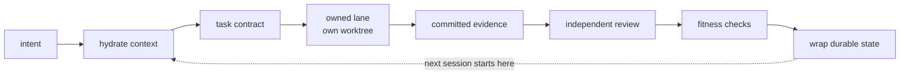

# BFF — Built Fucking Fast

**The repository is the memory. The chat is just a process.**

[](#install)
[](plugins/osiris)
[-5FA04E)](#development)
[](LICENSE)
[](https://github.com/triunai/bff/releases)

## Install

**Prerequisites:** the [GitHub CLI](https://cli.github.com) signed in with an account that can read `triunai/bff` (`gh auth login`; the repository is private), Python 3.9+, and, for Osiris, [BB](#install-in-30-seconds). No `sudo`; everything lands in your user directory.

macOS (Intel and Apple Silicon) and Linux:

```sh
sh -c "$(gh release download --repo triunai/bff --pattern install.sh -O -)" bff-install --setup
```

Windows: native Windows is a preview and stops before changing anything; use WSL2 (`wsl --install`), then run the macOS line above inside it. Once native Windows ships, this is its line (PowerShell 5.1 or 7):

```powershell
& ([scriptblock]::Create((gh release download --repo triunai/bff --pattern install.ps1 -O - | Out-String))) -Setup
```

Re-running either line updates in place. Both check `gh` first and print the exact fix if it is missing or signed out, download through `gh`, verify `SHA256SUMS` before installing, offer to add `~/.local/bin` to your `PATH` once (it asks, and prints the line instead if you decline), then run `bff osiris setup`. The script is passed to `sh` as an argument rather than piped in, so the PATH question can reach your terminal. Read it first with `gh release download --repo triunai/bff --pattern install.sh -O -`.

BFF is a portable CLI and a set of repo conventions for running coding agents without losing the plot. Osiris, its workbench, shows what the agents actually did. It runs inside **BB**, a separate desktop workbench app that hosts Osiris as a plugin; BFF does not install BB, so install it first if you want Osiris (the CLI works without it). [Install the CLI](#install-in-30-seconds) below.

> The CLI is public and usable today (v0.1.1). The one-command installer is not out yet; to hear when it ships, see [Get v0.2.0](#get-v020).

> This README tracks `main`. The README for the release you install is at the `v0.1.1` tag, so a file linked here (for example `docs/roadmap.md`) may not exist in your install.

<!-- GIF SLOT (10-20 s): docs/assets/osiris-factory.gif
     Shot: Osiris with synthetic data: open Toolcalls, type status:error, select a failed call, open Trace.
     Do NOT add the image link until the file exists; a missing file renders as a broken image on GitHub. -->

<!-- HERO SCREENSHOT SLOT: docs/assets/osiris-workbench.png
     Shot: Osiris in BB. Work list on the left, native chat in the centre, current-workspace Changes on the right. Synthetic data only. -->

## What is BFF?

Most agent work starts as a prompt and ends as archaeology.

```text
prompt -> giant context dump -> edits -> tests, probably -> "done" -> next session starts archaeology
```

BFF expects something closer to this, and each step leaves an artifact in the repository:

```text
intent -> hydrate -> contract -> owned lane -> evidence -> independent review -> fitness -> wrap
```



The chat is disposable. The spine, the contracts, the commits and the check output are not.

## Key capabilities

- **Doc-Spine.** Thread-aware durable project state that lives in the repository, not in a context window.
- **`hygiene.md` router.** One file owns the order of operations. Skills execute it; they do not reinvent it.
- **Task contracts.** Objective, allowed files, non-goals, validation commands and stop conditions, written before the agent starts.
- **Fitness before confidence.** `bff check --run` executes the commands you declare. A green command is evidence. It is not theology.
- **Independent review.** The author does not approve their own work. A separate review pass does.
- **Durable wraps.** Coordinated end-of-session updates instead of ceremonial summaries.
- **A checked context graph.** `bff check` validates the bound spine; `bff hydrate` prints context for one workstream without changing files.
- **Osiris.** A plugin for BB (the desktop workbench app above) that observes Claude Code and Codex tool calls, so you can inspect what happened instead of accepting the agent's recollection of it.

## Install in 30 seconds

This installs the BFF command-line tool. Osiris also needs BB, which you install separately first (see the top of this page); then run `bff osiris --install`.

Needs Python 3.9+, Git and `curl`. BB and Herdr (the separate terminal-session app BFF uses to capture agent runs) are upstream applications; BFF does not quietly install agent runtimes, rewrite your shell profile or seize your hooks.

```sh
curl -fsSLO https://raw.githubusercontent.com/triunai/bff/v0.1.1/install.sh
sh install.sh
bff doctor     # what is present, what is missing, what it would do
```

Download first, then run. You can read `install.sh` before it does anything. BFF does not ask you to pipe a script into a shell.

The bootstrap downloads the tagged release archive, verifies its checksum and file inventory, preserves the release under `~/.local/share/bff/releases/`, exposes `~/.local/bin/bff`, and tells you if that directory is missing from `PATH`. It does not edit your shell startup files. Checksum and archive share GitHub's publisher trust boundary; this is not an independently signed distribution. Adults may make their own threat-model decisions.

Rehearse without touching the normal prefix: `sh install.sh --prefix /tmp/bff-test`.

## Osiris

Agents are software. Software gets instrumented.

Osiris is BFF's tool-call workbench for BB. It observes Claude Code and Codex execution and lets you inspect retained traces, search tool calls, isolate failures and look at what happened around them.

<!-- SCREENSHOT SLOT: docs/assets/osiris-toolcalls.png
     Shot: the Toolcalls sidebar filtered with status:error, a list of recorded calls with one failed call selected. Synthetic threads only. -->

<!-- SCREENSHOT SLOT: docs/assets/osiris-trace.png
     Shot: Trace replacing the right pane for one selected call, conversation still visible in the centre. Synthetic data only. -->

Search syntax:

```text
status:error
tool:Bash
provider:codex
duration:>5s
```

What the public build (v0.1.1) includes today: native-chat inspection inside the BB workbench, a separate searchable Toolcalls surface, trace inspection, problem grouping, retained-history scanning, and local Claude Code and Codex capture through Herdr.

**Preview, not in any public release yet:** a Work surface (board, dependency graph, "decisions waiting on you"), an animated Factory view and selectable themes. They exist in the maintainer's development build and are being wired up. Do not expect them from the v0.1.1 bundle.

Osiris is evidence-first. A shell exit code is an observation, not necessarily a failure. A successful command is an observation, not necessarily progress.

```sh
bff osiris --install    # with BB already running (v0.1.1 behaviour)
```

BFF installs the included prebuilt Osiris plugin through BB and opens it. The tested baseline is BB 0.45+ against public SDK 0.6.15. Upstream compatibility remains upstream compatibility; BFF does not claim clairvoyance.

## How it works

```text
   your repository                              your machine
+--------------------------+            +-----------------------------+
| hygiene.md  (verb order) |            | Claude Code / Codex         |
| Doc-Spine   (state)      |            | agent lanes (own worktrees) |
| .bff.json   (checks)     |            +--------------+--------------+
+------------+-------------+                           | tool calls
             ^                                          v
             | bff hydrate / wrap           +-----------------------------+
             v                              | Herdr bridge: bff herdr     |
+--------------------------+                | bounded, metadata only      |
| BFF CLI (Python)         |                +--------------+--------------+
+--------------------------+                               v
                                            +-----------------------------+
 BB retained thread history ------------->  | Osiris (BB plugin, TS)      |
                                            | Work | chat | Trace | Calls |
                                            +-----------------------------+
```

The repo owns scope, decisions, evidence and process ordering. Osiris reads two distinct sources, BB's retained history and BFF's local provider capture, and does not guess identity across them. See [ARCHITECTURE.md](ARCHITECTURE.md).

## Architecture

```text
bff/                    Python CLI (stdlib only)
  cli.py                  argument parsing, subcommand dispatch
  project.py              init / check / hydrate over the bound spine
  doctor.py               companion-tool report, install and upgrade plan
  herdr.py, herdr_observer.py
                          bounded local Claude/Codex transcript capture
  launch.py               start / osiris launchers
plugins/osiris/         Osiris, a BB plugin (TypeScript + TSX, prebuilt in dist/)
templates/repo/         what `bff init` writes: hygiene.md, docs/ spine, skills
install.sh, install.py  pinned installer: verify, preserve, activate, disable
scripts/                release builder and release script
tests/                  Python unittest suite and Osiris tests
```

Four parts, kept separate: the Python CLI, the TypeScript UI and server inside one BB plugin, the Herdr capture bridge, and the conventions `bff init` puts into a repository.

## Stack

| Part | Technology | Notes |
| --- | --- | --- |
| CLI | Python 3.9+ | Standard library; unit tests with `unittest` |
| Workbench | TypeScript / TSX, BB plugin SDK 0.6.15 | Prebuilt assets in `plugins/osiris/dist` |
| Host | BB 0.45+ | Separate upstream application, tested baseline |
| Capture | Herdr bridge (`bff herdr`) | Reads local Claude Code and Codex transcripts, writes metadata only |
| Installer | POSIX `sh` + Python | Checksum and inventory verification, versioned releases, rollback |
| Dev tooling | Node 24, npm | Osiris tests and rebuild only; not needed to use BFF |
| CI | GitHub Actions | Python test suite on push and pull request |

## Why the name

Because "Enterprise Agentic Software Development Lifecycle Orchestration Framework" has multiple implementations already, and this is just what works for me.

And because speed is not how quickly an agent can emit code. Speed is:

- not rederiving common shapes that were already spotted once
- not repeating decisions that were already made
- not reviewing your own work with bias and calling it independent
- not losing context at the end of a thread
- not discovering three days later that the test suite never exercised the path
- not burning tokens recovering from preventable tool mistakes

Measure the work, keep the evidence, and leave less bullshit for the next run.

Agentic development gets slow in stupid ways. The model forgets what it was doing. Two agents edit the same assumption. A review says "looks good." A tool call fails, the agent burns ten thousand tokens recovering, and the only record is a red line in a transcript nobody will read again. "The model has a big context window" is not an engineering methodology. The point is not to make agents type faster. The point is to stop paying them to rediscover the same repo.

> If an agent cannot tell you what it changed, why it changed, what proved it, and where the evidence lives, the work is not finished.

BFF is opinionated about that. It is deliberately not opinionated about which model you worship this month. Claude, Codex, OMC, OMX and the rest remain yours.

---

# Reference

Everything below is detail. The top of this page is the whole pitch.

<details>
<summary><strong>Start the workbench</strong></summary>

```sh
bff start
```

This opens the existing BB workbench and requests an independent named Herdr session in a terminal on supported platforms. It does not install either application. It does not claim that a process started merely because it asked nicely.

```sh
bff start --print-plan   # the plan without execution
bff osiris --print-url   # the Osiris URL only
```

</details>

<details>
<summary><strong>Doctor: companion tools</strong></summary>

There are enough agent-development tools now that remembering which package manager owns which one has become an embarrassing use of human memory.

```sh
bff doctor              # inspect, plan, ask once
bff doctor --yes        # execute the plan
bff doctor --no-upgrade # install missing tools only
bff doctor --offline    # skip BFF's release check
bff doctor --json       # report only; machine-readable
```

`doctor` checks BFF, Herdr, Beads, OMC, OMX, BB and aeh. For tools with documented package-manager ownership, it compares the installed version with the latest stable version and plans the appropriate install or upgrade. For tools without a supported automated route, it says so.

No `sudo`. No shell-string roulette. No piping mystery installers into another mystery installer. Each action is printed before execution, run independently, and verified afterwards. One failure does not prevent unrelated work from continuing.

```text
Herdr  -> brew
Beads  -> brew / npm
OMC    -> npm
OMX    -> npm
BB     -> manual
aeh    -> manual
```

`doctor` also compares BFF's own version with the latest GitHub release (one unauthenticated call, short timeout, `unknown` on failure) and prints the install command for a newer tag. It never runs it.

</details>

<details>
<summary><strong>Observe Claude Code and Codex</strong></summary>

```sh
bff herdr
```

Keep it running in the foreground, then choose `••• -> Source -> Herdr / local provider capture`. Osiris receives bounded snapshots from recent local Claude Code and Codex transcripts every five seconds.

```sh
bff herdr --once
bff herdr --latest 4
bff herdr --session <exact-session>
```

Claude Bash calls and Codex `commandExecution` calls are currently observable. Commands you typed yourself are not magically Claude's commands. Herdr pane membership is not currently proven. BB thread identity is not guessed. A fresh capture timestamp is not called a heartbeat.

Different evidence sources stay different until there is evidence that they are the same thing. That sounds pedantic until the first time bad telemetry convinces you of something that never happened.

Osiris reports retained-history caps, scan failures and unknown outcomes as such: no complete-fleet percentage without a known denominator, and no recovered or root-cause labels without evidence. Metadata exports exclude prompts, tool inputs and outputs, and credentials. See [plugins/osiris/README.md](plugins/osiris/README.md).

</details>

<details>
<summary><strong>Adopt a repository</strong></summary>

```sh
bff init --repo /path/to/repo
bff check --repo /path/to/repo
bff hydrate --repo /path/to/repo --ws WS-01
```

`init` does not flatten an existing repository into BFF's preferred worldview. Existing files are preserved. Existing documentation systems require an explicit binding or migration.

```text
repo docs     -> scope, facts, decisions, evidence
hygiene.md    -> execution order
orchestrator  -> authoritative spine writes and numbering
lanes         -> committed evidence in their own worktrees
```

Boring ownership rules are cheaper than clever merge conflicts.

Canonical BFF skills live under `.agents/skills/bff-*`: task contracts, hydration, thermonuclear quality review and thermonuclear wraps. Use them through your agent's supported discovery mechanism. BFF does not silently install global aliases and then act surprised when your existing setup breaks.

</details>

<details>
<summary><strong>Fitness before confidence</strong></summary>

Configure actual project checks in `.bff.json`, then:

```sh
bff check --run
```

This executes the configured test, build and fitness commands with the normal permissions of the machine running BFF.

A green command is evidence. It is not theology. Important invariants should have teeth checks. Critical paths should have real tests. The output tells you what BFF actually verified and where enforcement stops.

Installation does not silently rewrite Git hooks, configure branch protection, enable CI, manufacture model reviews or declare your repository correct. Those are engineering decisions, so BFF leaves them visible.

</details>

<details>
<summary><strong>Context is promoted, not dumped</strong></summary>

Obsidian and other external knowledge sources are additive teaching material. Hydrate what matters, record where it came from, and promote reviewed knowledge into one durable home in the repository. Do not turn a private vault into a second undocumented runtime dependency and then wonder why nobody else can reproduce the project.

See [ARCHITECTURE.md](ARCHITECTURE.md) and [PROVENANCE.md](PROVENANCE.md). Private vaults, credentials, historical sessions and someone's heroic laptop state are not part of the distribution.

</details>

<details>
<summary><strong>Rollback</strong></summary>

Releases are preserved. Activate one, or disable the owned command link:

```sh
python3 install.py --activate <preserved-release>
python3 install.py --disable
```

Neither operation pretends your project files or runtime state belong to BFF.

</details>

## Development

```sh
python3 -m unittest discover -s tests -q

npm ci
npm run test:osiris

python3 scripts/build-bff-release.py --output /tmp/bff-release
```

Node 24 is used for Osiris development tests. Osiris source and prebuilt assets live under `plugins/osiris`. The Python CLI and the TypeScript UI/server are separate components shipped in one SDK. See component notices for upstream licensing.

## Status and roadmap

BFF is bootstrap-stage software. That means two things: it already has a real job, and it is not going to lie about jobs it cannot do yet.

| Piece | State |
| --- | --- |
| `bff init / check / hydrate`, `bff check --run` | Shipped, v0.1.1 |
| `bff doctor` (install and upgrade companion tools after one prompt) | Shipped, v0.1.1 |
| `bff herdr`, `bff start`, Osiris tool-call observer and Toolcalls search | Shipped, v0.1.1 bundle |
| Osiris Work surface (board, graph, decisions), Factory view, themes | Preview. Built in the maintainer's development build, **not in any public release** |
| One-command installer (`install.sh --setup`), `bff update`, `bff rollback`, `install.ps1` | Coming in v0.2.0. Designed and being built; **not available today** |
| Windows | Designed, untested |
| Full agent lineage, landing visualisation, manual terminal (PTY) recording | Not implemented |
| Enforced hooks and automatic CI adoption | Not implemented. Installation never overwrites hooks or configures branch protection |
| Live Beads / Gas / DSH adapters and their evals | Not implemented |

Those are roadmap items, not creatively worded existing features. [CHANGELOG.md](CHANGELOG.md) records the exact shipped surface by release; [docs/roadmap.md](docs/roadmap.md) lists candidates, not commitments. Existing OMC / OMX / Claude / Codex configuration stays user-owned.

v0.1.1's `bff doctor` prints its own one-line install hint when a newer release exists. Prefer the download-then-run form in [Install](#install-in-30-seconds), and read the script first.

## Coming in v0.2.0 (not released; none of this works today)

The planned shape is three commands. Do not copy them yet; they fail on v0.1.1:

```text
curl -fsSLO https://github.com/triunai/bff/releases/latest/download/install.sh && sh install.sh --setup   # get + first-time setup
bff osiris                                                                                              # run
bff update                                                                                              # update bff and the Osiris plugin
```

`bff update` is planned to show *current → target* and ask `Update available? [Y/n]`, `bff rollback` to switch back to the previous release, and `install.ps1` to bring a Windows preview. Windows is untested. Until a release says otherwise, treat all of this as design, not as a feature. Details are in [docs/roadmap.md](docs/roadmap.md) and the [CHANGELOG](CHANGELOG.md).

## Get v0.2.0

On this repository's GitHub page choose **Watch → Custom → Releases** (and ⭐ Star if you like) to hear when v0.2.0 ships. No email is collected by this project; GitHub holds the subscription and you control it.

## License

MIT for BFF-authored code ([LICENSE](LICENSE)). Osiris carries its own notices for upstream components: [plugins/osiris/THIRD_PARTY_NOTICES.txt](plugins/osiris/THIRD_PARTY_NOTICES.txt). BB and Herdr are separate upstream products with their own licenses; see [PROVENANCE.md](PROVENANCE.md).
